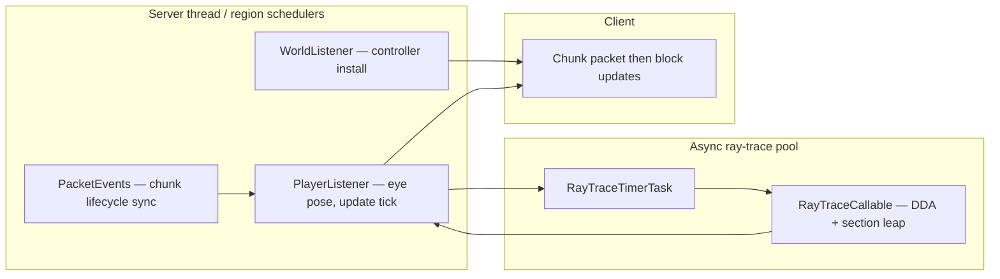

# RayTraceAntiXray

Server-side ray-tracing extension for [Paper Anti-Xray](https://docs.papermc.io/paper/anti-xray/) **engine-mode 1** (`HIDE`). The plugin evaluates line-of-sight from each player to ore blocks that are **exposed to air**—a class Paper does not obfuscate—and updates per-player chunk payloads accordingly.


---

## 1. Background

Paper Anti-Xray in **engine-mode 1** replaces hidden blocks (e.g. ores) with decoy blocks (stone, deepslate, etc.) inside chunk packets. That mechanism targets blocks **not** adjacent to air. Ores on cave walls or in open pockets remain visible in the raw chunk data, which defeats the purpose of anti-xray for those positions.

RayTraceAntiXray closes this gap by:

1. Identifying trace candidates when a chunk is prepared for a player.
2. Obfuscating those positions in the outgoing packet (same decoy blocks as Paper).
3. Running asynchronous visibility tests from the player’s eye (and optionally third-person origins).
4. Sending **block-update** packets to reveal only blocks with an unobstructed line of sight.

Block entities (e.g. chests) can be fully hidden on supported versions; see Paper and plugin release notes.

---

## 2. Method

### 2.1 Per-chunk candidate set

When Paper’s `ChunkPacketBlockController` builds a chunk packet, the plugin records world positions of configured block types that are **exposed to air**, subject to:

- Paper’s `hidden-blocks` / height limits (when `ray-trace-blocks` is empty).
- `max-ray-trace-block-count-per-chunk` (bottom-up cap per chunk).

This set is fixed for that chunk send until the chunk is sent again; placements and breaks are not reflected until then.

### 2.2 Initial obfuscation

Candidates are written into the palette as decoy states before the client receives the chunk. The player initially sees stone (or dimension-appropriate filler), not the true ore.

### 2.3 Visibility test (ray casting)

On a configurable schedule, a thread pool traces rays from each online player toward queued blocks within `ray-trace-distance`:

| Stage | Description |
|--------|-------------|
| **Frustum culling** | Optional early reject using view direction. |
| **Section leap** | If `section-leap: true` and `LevelChunkSection#hasOnlyAir()` holds for the current 16³ section, skip voxels in that section via analytic section exit (`SectionRayMath`) and resume DDA at the boundary. |
| **Voxel traversal** | Amanatides–Woo DDA (`BlockIterator`) steps along the ray. |
| **Occlusion** | Solid blocks and adjacent-face checks (`BlockOcclusionCulling`) determine obstruction. |
| **Conservative bias** | Ambiguous or unloaded geometry is treated as **occluding**; when culling is uncertain, visibility errs toward **revealed** rather than falsely hidden. |

Results are queued per player and flushed as batched `ClientboundBlockUpdatePacket` (single Netty flush per batch where possible).

### 2.4 Rehide (optional)

With `rehide-blocks: true`, blocks that leave the visible set (subject to `rehide-distance`) can be obfuscated again without waiting for a full chunk resend.

---

## 3. Architecture (this fork)

Fork of [stonar96/RayTraceAntiXray](https://github.com/stonar96/RayTraceAntiXray). Operational differences are documented in [FORK.md](FORK.md).



| Component | Role |
|-----------|------|
| `ChunkPacketBlockControllerAntiXray` | Hooks Paper chunk obfuscation; enqueues per-player block lists. |
| `PacketListener` | Aligns player state with outgoing chunk / unload / respawn packets (PacketEvents). |
| `RayTraceTimerTask` | Paper async scheduler tick; `invokeAll` per player on the ray pool. |
| `UpdateBukkitRunnable` | Drains visibility results; batches block updates on the player scheduler (Folia-safe). |

**Runtime dependencies:** Paper (Folia-capable builds where applicable), [PacketEvents](https://modrinth.com/plugin/packetevents), Paper Anti-Xray **engine-mode 1**.

Anonymous usage metrics via [bStats](https://bstats.org/plugin/bukkit/RayTraceAntiXray/31528) (relocated in the plugin JAR). Opt out with `plugins/bStats/config.yml` on the server.

---

## 4. Build targets (`paperTarget`)

One **`main`** branch; pick the Paper generation at **compile time** with `-PpaperTarget=…`. Each build produces a classified JAR, e.g. `RayTraceAntiXray-1.17.3-26.1.2.jar`.

| `paperTarget` | Minecraft / Paper | Java (toolchain) | `plugin.yml` `api-version` |
|---------------|-------------------|------------------|----------------------------|
| **`1.21.11`** | 1.21.11 | 21 | `1.21.11` |
| **`26.1.2`** | 26.1.2 (26.x) | 25 | `26.1.2` |

NMS differences are isolated in `com.vanillage.raytraceantixray.nms.NmsCompat` under `RayTraceAntiXray/src/nms/paper-<target>/` — see [FORK.md § Build targets](FORK.md#build-targets-papertarget).

```bash
# Default (gradle.properties paperTarget=26.1.2)
./gradlew build

# Paper 1.21.11 server
./gradlew build -PpaperTarget=1.21.11
```

Install the JAR whose **classifier matches your server** (`-1.21.11` or `-26.1.2`).

---

## 5. Installation

1. Install [Paper](https://papermc.io/downloads/paper) for your generation (**1.21.11** or **26.1.2**).
2. Enable Paper Anti-Xray with **`engine-mode: 1`** ([documentation](https://docs.papermc.io/paper/anti-xray/)).
3. Install **PacketEvents** (Spigot/Paper build).
4. Install the matching **RayTraceAntiXray** JAR ([release](https://builtbybit.com/resources/raytraceantixray.24914/) or `./gradlew build -PpaperTarget=…`).
5. Edit `plugins/RayTraceAntiXray/config.yml` ([defaults](RayTraceAntiXray/src/main/resources/config.yml)).
6. **Restart the server** after first install or JAR replacement.

**Do not** use Bukkit `/reload`, PlugMan-style hot plug, or enable/disable the JAR on a running server; chunk controllers and per-player state will desynchronize.

Recommended tuning reference: [stonar96’s settings gist](https://gist.github.com/stonar96/69ca0311392188b7ac2ece226286147f).

---

## 6. Configuration

Global scheduler settings (`settings.anti-xray`):

| Key | Meaning |
|-----|---------|
| `ray-trace-threads` | Fixed thread pool size for visibility work. |
| `ms-per-ray-trace-tick` | Async scheduler period between ray batches. |
| `update-ticks` | Player scheduler period for sending block updates. |

Per-world (`world-settings.<world>.anti-xray`, inherits `default`):

| Key | Meaning |
|-----|---------|
| `ray-trace` | Enable plugin logic for this world (requires Paper AX + engine-mode 1). |
| `ray-trace-distance` | Max distance (blocks) for visibility tests. |
| `ray-trace-third-person` | Additional rays for third-person camera origins (costly). |
| `section-leap` | Opt-in: skip air-only 16³ sections before DDA (`false` by default). |
| `rehide-blocks` / `rehide-distance` | Dynamic re-obfuscation when LOS is lost. |
| `max-ray-trace-block-count-per-chunk` | Cap on traced positions per chunk send. |
| `ray-trace-blocks` | Block list; empty = Paper `hidden-blocks`. |

---

## 7. Commands

Requires `raytraceantixray.command.raytraceantixray`. Full permission tree: `plugins/RayTraceAntiXray/README.txt` (generated on first run).

| Command | Permission suffix | Effect |
|---------|-------------------|--------|
| `/raytraceantixray reload` | `.reload` | Reload `config.yml`; restart ray pool and tick; reinstall world controllers; re-register players. |
| `/raytraceantixray timings on\|off` | `.timings.on` / `.timings.off` | Log per-tick ray batch duration to console. |

**Reload limits:** Does not replace a restart after changing the plugin binary, Paper Anti-Xray, or PacketEvents. Players with inconsistent obfuscation should reconnect. Chunk block lists are not rebuilt until chunks are sent again.

---

## 8. Development

```bash
# Unit tests for default paperTarget (excludes @Tag("bench"))
./gradlew test

# Other target
./gradlew test -PpaperTarget=1.21.11

# Section-leap vs pure DDA micro-benchmark (stdout table)
./gradlew bench --rerun-tasks -PpaperTarget=26.1.2
```

---

## 9. Limitations

- **CPU cost** scales with player count, `ray-trace-threads`, blocks per chunk, distance, and third-person mode. Dedicated spare cores are recommended so the main thread stays responsive.
- **Culling is approximate** by design; conservative visibility reduces false hides at the cost of occasional early reveals under load.
- **Static per-send block lists** until chunk resend; mining or placing ores does not update the trace set immediately.
- **Section leap** depends on `hasOnlyAir()`; false negatives skip optimization; false positives would be unsafe and are avoided by conservative section queries on unloaded data.

---

## 10. Demonstration (historical)


---

## 11. License

Source is governed by [LICENSE](LICENSE). Redistribution of **compiled plugin JARs** intended for direct server use as RayTraceAntiXray is **not** permitted. Use as a library or shaded dependency for other projects is allowed.

Implementation and fork maintenance notes: [FORK.md](FORK.md).
